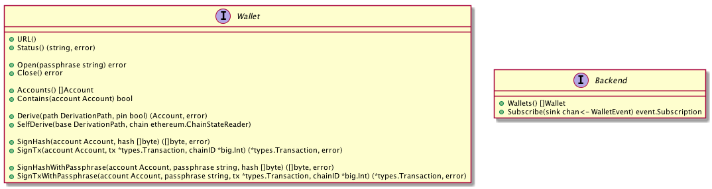

## GO-ETHEREUM

My own understanding and summary of [ethereum/go-ethereum: Official Go implementation of the Ethereum protocol](https://github.com/ethereum/go-ethereum) inspired by [NAKsir-melody/go-ethereum: Translate code comments into korean (한국어 주석번역 프로젝트)](https://github.com/NAKsir-melody/go-ethereum).

For my own understanding the ethereum, I will briefly summarize it as I read the code.

- UML diagram
- Summary by myself
- ...

## Modules

### Accounts

